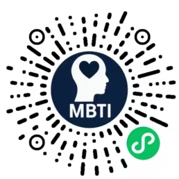

<!DOCTYPE html>
<html lang="zh-CN">
<head>
    <meta charset="UTF-8">
    <meta name="viewport" content="width=device-width, initial-scale=1.0">
    <title>起点中文网自动签到系统 - Python自动化签到脚本 | Qidian Auto Sign System</title>
    <meta name="description" content="基于Python+Appium的起点中文网自动签到系统，支持Docker部署，24小时自动签到，保护设备电池，支持服务器挂机运行。">
    <meta name="keywords" content="起点中文网,自动签到,Python自动化,Appium,签到脚本,Docker部署,服务器挂机,移动端自动化">
    <meta name="author" content="xinyuan">
    <meta name="robots" content="index,follow">
    
    <!-- Open Graph / Facebook -->
    <meta property="og:type" content="website">
    <meta property="og:url" content="https://github.com/a27856704/qidian-sign">
    <meta property="og:title" content="起点中文网自动签到系统">
    <meta property="og:description" content="Python自动化签到脚本，支持Docker部署，24小时自动运行">
    <meta property="og:image" content="./screenshots/装逼图.jpg">
    
    <!-- Twitter -->
    <meta property="twitter:card" content="summary_large_image">
    <meta property="twitter:url" content="https://github.com/a27856704/qidian-sign">
    <meta property="twitter:title" content="起点中文网自动签到系统">
    <meta property="twitter:description" content="Python自动化签到脚本，支持Docker部署，24小时自动运行">
    <meta property="twitter:image" content="./screenshots/装逼图.jpg">
    
    <!-- JSON-LD 结构化数据 -->
    <script type="application/ld+json">
    {
        "@context": "https://schema.org",
        "@type": "SoftwareApplication",
        "name": "起点中文网自动签到系统",
        "alternateName": "Qidian Auto Sign System",
        "description": "基于Python+Appium的起点中文网自动签到系统，支持Docker部署，24小时自动签到",
        "url": "https://github.com/a27856704/qidian-sign",
        "applicationCategory": "Automation Tool",
        "operatingSystem": "Windows, macOS, Linux",
        "programmingLanguage": "Python",
        "author": {
            "@type": "Person",
            "name": "xinyuan",
            "email": "xinyuan56133718@126.com"
        },
        "offers": {
            "@type": "Offer",
            "price": "0",
            "priceCurrency": "CNY"
        },
        "keywords": ["起点中文网", "自动签到", "Python自动化", "Appium", "Docker部署"]
    }
    </script>
</head>
<body>

# 起点中文网自动签到系统 / Qidian Auto Sign System

[](https://www.python.org/)
[](https://appium.io/)
[](https://docs.docker.com/compose/)

## 📱 项目截图 / Project Screenshot

<div align="center">


</div>

> 上图展示了起点中文网APP的书架界面，包含签到功能（已连签2566天）和书籍管理功能。本项目旨在自动化这个签到过程，让用户无需手动操作即可完成每日签到任务。

## 📖 项目简介 / Project Description

这是一个基于 Python + Appium 的起点中文网自动签到系统，支持 Docker 容器化部署，能够自动完成起点中文网 APP 的每日签到任务，并通过邮件通知签到结果。

**🔥 为什么选择这个项目？**
- 🚀 **解放双手**: 告别每日手动签到，让AI帮你完成
- 💰 **签到奖励**: 自动获取起点中文网的每日签到奖励和积分
- 🔋 **保护设备**: 避免手机长时间运行导致电池损耗和发热问题
- 🖥️ **服务器友好**: 支持在服务器上运行，24小时不间断签到
- 🐳 **一键部署**: Docker容器化，开箱即用，无需复杂配置

**🎯 适用场景**
- 📱 起点中文网忠实用户，不想错过每日签到
- 🖥️ 有服务器资源，希望24小时稳定运行
- 🔧 技术爱好者，想要学习Python自动化技术
- 💻 不想让手机长时间运行，保护设备安全

This is an automated sign-in system for Qidian Chinese Network based on Python + Appium, supporting Docker containerized deployment. It can automatically complete daily sign-in tasks on the Qidian Chinese Network APP and notify sign-in results via email.

## ✨ 功能特性 / Features

- 🔄 **自动签到**: 支持定时自动签到，无需手动操作
- 📱 **Appium 驱动**: 基于 Appium 实现 APP 自动化操作
- 📧 **邮件通知**: 签到完成后自动发送邮件通知
- 🐳 **Docker 部署**: 提供完整的 Docker 容器化部署方案
- ⏰ **定时任务**: 支持自定义签到时间（默认每天 01:00 和 12:00）
- 🔧 **环境配置**: 支持测试环境和生产环境配置
- 📝 **日志记录**: 完整的日志记录和轮转功能
- 🚀 **性能优化**: 智能重试机制，确保签到成功率
- 🔒 **安全可靠**: 支持多账号管理，数据加密存储

## 🏗️ 系统架构 / System Architecture

```
qidian-sign/
├── docker-appium/          # Appium 服务容器配置
│   ├── docker-compose.yml  # Appium 容器编排
│   └── apk_pack/          # APK 安装包目录
├── docker-python/          # Python 应用容器配置
│   ├── docker-compose.yml  # Python 容器编排
│   ├── qidian_config.yml   # 应用配置文件
│   └── start.sh           # 启动脚本
├── driverTools/            # Appium 驱动工具
│   ├── LinkAppium.py      # Appium 连接和操作类
│   └── AppiumDriverContext.py # 驱动上下文管理
├── mail/                   # 邮件发送模块
│   └── mail.py            # 邮件发送实现
├── exceptions/             # 自定义异常类
├── qidianAutoSign.py      # 主程序入口
└── requirements.txt        # Python 依赖包
```

## 🚀 快速开始 / Quick Start

### 🎯 环境要求 / Requirements

- 🐳 **Docker & Docker Compose** - 容器化部署环境
- 🐍 **Python 3.12** - 推荐使用官方 Python 3.12 镜像
- 📱 **Android 设备或模拟器** - 支持真机和模拟器运行
- 📚 **起点中文网 APP** - 最新版本，确保功能正常

### 🌟 部署优势 / Deployment Advantages

- **💻 电脑模拟器**: 支持在电脑上运行Android模拟器，不占用手机资源
- **🖥️ 服务器部署**: 可在云服务器上24小时稳定运行
- **🔋 保护设备**: 避免手机长时间运行导致的电池损耗和发热问题
- **⚡ 高效稳定**: 自动化运行，比手动操作更稳定可靠

### 1. 克隆项目 / Clone Project

```bash
git clone <repository-url>
cd qidian-sign
```

### 2. 配置环境 / Configure Environment

编辑 `docker-python/qidian_config.yml` 文件：

```yaml
# 测试环境配置
test:
  THREAD_DELAY: 1
  DEBUG: true
  DICT_MAIL_TO_USERS:
    '用户名': '邮箱地址'
  TIP_MSG:

# 正式环境配置
prod:
  THREAD_DELAY: 60
  DEBUG: false
  DICT_MAIL_TO_USERS:
    '用户名': '邮箱地址'
  TIP_MSG:
```

### 3. 配置邮件服务 / Configure Email Service

编辑 `qidianAutoSign.py` 中的邮件配置：

```python
MAIL_FROM_USER = '你的邮箱服务器账号@qq.com'
MAIL_FROM_PASSWORD = '你的邮箱服务器授权码'
MAIL_SMTP_SERVER = 'smtp.qq.com'
MAIL_SMTP_PORT = 465
```

### 4. 启动服务 / Start Services

#### 启动 Appium 服务 / Start Appium Service

```bash
cd docker-appium
docker-compose up -d
```

#### 启动 Python 应用 / Start Python Application

```bash
cd docker-python
docker-compose up -d
```

## 📱 使用方法 / Usage

### 测试模式 / Test Mode

```bash
python qidianAutoSign.py --env=test
```

### 生产模式 / Production Mode

```bash
python qidianAutoSign.py --env=prod
```

### Docker 模式 / Docker Mode

应用会自动在容器中运行，无需手动启动。

## 🔧 配置说明 / Configuration

### 🎛️ 环境变量 / Environment Variables

| 变量名 | 说明 | 默认值 |
|--------|------|--------|
| `THREAD_DELAY` | 线程延迟时间（秒） | 60 |
| `DEBUG` | 调试模式 | false |
| `DICT_MAIL_TO_USERS` | 用户名到邮箱的映射 | {} |
| `TIP_MSG` | 自定义提示消息 | {} |

### 🔮 下一步计划 / Next Steps

- **📱 APK 签到功能**: 正在开发基于APK的签到功能，无需模拟器
- **🖥️ 电脑挂机**: 支持在电脑上直接运行，适合有服务器的小伙伴
- **🔋 设备保护**: 解决手机电池损耗问题，让签到更安全
- **🚀 性能提升**: 优化运行效率，减少资源占用

### 签到时间 / Sign-in Schedule

默认签到时间：
- 每天 01:00
- 每天 12:00

可在 `qidianAutoSign.py` 中修改：

```python
schedule.every().day.at("12:00").do(run_task)
schedule.every().day.at("01:00").do(run_task)
```

## 🐳 Docker 部署 / Docker Deployment

### 网络配置 / Network Configuration

创建 Docker 网络：

```bash
docker network create home_net
```

### 服务管理 / Service Management

#### 启动所有服务 / Start All Services

```bash
# 启动 Appium 服务
cd docker-appium && docker-compose up -d

# 启动 Python 应用
cd docker-python && docker-compose up -d
```

#### 查看服务状态 / Check Service Status

```bash
docker-compose ps
```

#### 查看日志 / View Logs

```bash
# Appium 服务日志
cd docker-appium && docker-compose logs -f

# Python 应用日志
cd docker-python && docker-compose logs -f
```

#### 停止服务 / Stop Services

```bash
# 停止 Appium 服务
cd docker-appium && docker-compose down

# 停止 Python 应用
cd docker-python && docker-compose down
```

## 📋 依赖包 / Dependencies

主要依赖包：

- `Appium-Python-Client==4.0.0` - Appium Python 客户端
- `schedule==1.2.0` - 任务调度
- `PyYAML` - YAML 配置文件解析
- `beautifulsoup4` - HTML 解析
- `Django==4.2.10` - Web 框架

> **注意**: 本项目使用 Python 3.12 版本，确保与 Docker 容器中的 Python 版本保持一致。

## 🎁 额外福利 / Bonus

### 🧠 MBTI 性格测试小程序

除了签到系统，我还开发了一个 **MBTI 性格测试小程序**，完全免费使用！

- **🎯 测试准确**: 基于权威MBTI理论，测试结果更准确
- **💯 完全免费**: 不收费，纯公益项目
- **📱 随时测试**: 支持手机和电脑访问
- **🔍 深入了解**: 帮助你更好地了解自己的性格特点

<div align="center">

#### 📱 扫码体验 / Scan to Experience



**扫描二维码，立即开始你的MBTI性格测试之旅！**

</div>

> 💡 **小贴士**: 测试完成后，可以分享给朋友一起测试，看看谁更了解自己！

完整依赖列表请查看 `requirements.txt`。

## 📝 日志 / Logging

- 日志文件：`qidian-console.log`
- 日志轮转：每天轮转一次
- 保留天数：2天
- 日志格式：`时间 - 级别 - 消息`

## 🚨 注意事项 / Important Notes

1. **设备连接**: 确保 Android 设备已正确连接并启用 USB 调试
2. **APP 安装**: 确保起点中文网 APP 已安装在设备上
3. **权限设置**: 确保 APP 具有必要的权限（通知、存储等）
4. **网络环境**: 确保设备网络连接正常
5. **邮箱配置**: 使用 QQ 邮箱需要获取授权码，不是登录密码

## 🤝 贡献 / Contributing

欢迎提交 Issue 和 Pull Request！

## 📄 许可证 / License

本项目采用 MIT 许可证。

## 💰 赞助支持 / Sponsorship

如果这个项目对你有帮助，欢迎打钱支持！

If this project helps you, welcome to sponsor!

<div align="center">

### 支付宝 / Alipay


### 微信支付 / WeChat Pay


</div>

---

## 📞 联系方式 / Contact

如有问题或建议，请通过以下方式联系：

- 🐛 提交 Issue
- 📧 发送邮件至：**xinyuan56133718@126.com**

> 💡 **说明**: 本README文档的英文部分均由AI翻译工具生成，如有语法错误或表达不当，请见谅。欢迎用中文交流！

> 💡 **Note**: The English parts of this README document are generated by AI translation tools. Please forgive any grammatical errors or inappropriate expressions. Chinese communication is welcome!

## 🎯 项目亮点 / Project Highlights

### 🚀 技术特色
- **Python自动化**: 基于Python 3.12的现代化自动化解决方案
- **Appium驱动**: 专业的移动端自动化测试框架
- **Docker部署**: 一键部署，开箱即用的容器化方案
- **智能调度**: 支持自定义时间的智能签到调度系统

### 🌟 用户价值
- **解放双手**: 告别每日手动签到，让生活更轻松
- **保护设备**: 避免手机长时间运行，延长设备寿命
- **稳定可靠**: 24小时不间断运行，签到从不遗漏
- **免费开源**: 完全免费使用，代码完全开源

### 🔥 热门功能
- 起点中文网自动签到
- Python自动化脚本
- 移动端自动化测试
- 服务器挂机签到
- Docker容器化部署

---

**免责声明**: 本工具仅供学习和研究使用，请遵守相关网站的使用条款和法律法规。

</body>
</html> 